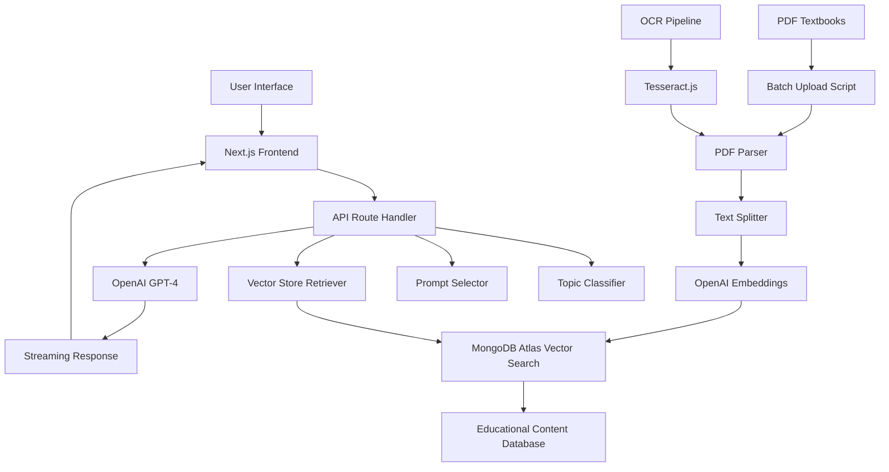

# UAE K-12 Educational RAG Bot: Comprehensive Technical Guide

## Table of Contents

1. [System Overview](#system-overview)
2. [Architecture](#architecture)
3. [Data Ingestion Pipeline](#data-ingestion-pipeline)
4. [RAG Implementation](#rag-implementation)
5. [API Endpoints](#api-endpoints)
6. [Frontend Integration](#frontend-integration)
7. [Educational Intelligence](#educational-intelligence)
8. [Database Schema](#database-schema)
9. [Deployment](#deployment)
10. [Performance Optimization](#performance-optimization)
11. [Monitoring and Logging](#monitoring-and-logging)
12. [Troubleshooting](#troubleshooting)

## System Overview

The UAE K-12 Educational RAG Bot is a sophisticated Retrieval-Augmented Generation system specifically designed for the UAE educational curriculum (Grades 1-12). The system combines MongoDB Atlas Vector Search capabilities with OpenAI's language models to provide contextually accurate educational assistance in both Arabic and English.

### Key Features

- **Bilingual Support**: Native Arabic and English processing
- **Curriculum-Aligned**: UAE Ministry of Education textbook content
- **Subject-Specific**: Specialized prompts for Mathematics, Physics, Chemistry, Biology, Languages, Social Studies, and Islamic Education
- **Practice Question Generation**: Automatically generates 10 comprehensive practice questions with scaffolded answers
- **Real-time Vector Search**: Sub-second retrieval from 200+ UAE textbooks
- **Intelligent Topic Classification**: Automatic subject detection and prompt selection

### Technology Stack

- **Frontend**: Next.js 14 with React 18, TailwindCSS
- **Backend**: Node.js with TypeScript
- **Database**: MongoDB Atlas with Vector Search
- **AI/ML**: OpenAI GPT-4 Turbo, OpenAI Embeddings (text-embedding-ada-002)
- **Vector Store**: LangChain + MongoDB Atlas Vector Search
- **PDF Processing**: pdf-parse, Tesseract.js for OCR
- **Deployment**: Vercel

## Architecture



### System Components

1. **Frontend Layer** (`src/app/`)

   - React-based chat interface with markdown support
   - Bilingual input handling with automatic text direction
   - Real-time streaming responses
   - Mathematical equation rendering with KaTeX

2. **API Layer** (`src/app/api/chat/`)

   - RESTful endpoint handling chat requests
   - Integration with LangChain for conversation management
   - Streaming response implementation

3. **Business Logic Layer** (`src/utils/`)

   - Topic classification system
   - Educational prompt management
   - Vector store configuration
   - OpenAI integration

4. **Data Processing Layer** (`scripts/`)

   - Batch PDF upload and processing
   - OCR for Arabic text extraction
   - Text chunking and embedding generation
   - Database management utilities

5. **Database Layer**
   - MongoDB Atlas cluster with vector search capabilities
   - Document collections for training data and tracking
   - Vector index configuration

## Data Ingestion Pipeline

### PDF Processing Workflow

The system processes UAE educational textbooks through a sophisticated multi-stage pipeline:

#### 1. File Discovery and Tracking (`scripts/batchUploadTextbooks.ts`)

```typescript
class TextbookUploader {
  private processedFiles: Set<string> = new Set();
  private trackingCollection: Collection<UploadTracker>;

  async processDirectory(dirPath: string): Promise<void> {
    const files = await fs.readdir(dirPath, { withFileTypes: true });

    for (const file of files) {
      if (file.isDirectory()) {
        await this.processDirectory(fullPath); // Recursive processing
      } else if (file.name.toLowerCase().endsWith(".pdf")) {
        await this.processFile(fullPath, file.name);
      }
    }
  }
}
```

**Key Features:**

- Recursive directory traversal
- Duplicate detection and skipping
- Progress tracking in MongoDB
- Error handling and retry logic

#### 2. PDF Text Extraction

```typescript
// Standard PDF text extraction
const pdfData = await pdf(dataBuffer);

// OCR fallback for image-based PDFs (Arabic content)
if (!pdfData.text || pdfData.text.trim().length === 0) {
  // OCR processing with Tesseract.js
  const ocrText = await processWithOCR(filePath);
}
```

**Extraction Methods:**

- **Primary**: Native PDF text extraction using `pdf-parse`
- **Fallback**: OCR using Tesseract.js for Arabic textbooks
- **Languages**: Arabic (`ara.traineddata`) and English (`eng.traineddata`)

#### 3. Text Chunking Strategy

```typescript
const splitter = new CharacterTextSplitter({
  separator: "\n",
  chunkSize: 1000, // Optimal for educational content
  chunkOverlap: 100, // Maintains context between chunks
});

const chunks = await splitter.splitText(pdfData.text);
```

**Chunking Parameters:**

- **Chunk Size**: 1000 characters (balances context and specificity)
- **Overlap**: 100 characters (ensures concept continuity)
- **Separator**: Newline-based (preserves natural content breaks)

#### 4. Metadata Enhancement

```typescript
const metadata = chunks.map((chunk, index) => ({
  source: fileName,
  type: "textbook",
  language: detectLanguage(chunk),
  subject: classifySubject(fileName),
  grade: extractGrade(fileName),
  chunkIndex: index,
  totalChunks: chunks.length,
  extractionMethod: "pdf-parse" | "ocr",
}));
```

#### 5. Vector Embedding Generation

```typescript
const embeddings = new OpenAIEmbeddings({
  openAIApiKey: process.env.OPENAI_API_KEY,
  modelName: "text-embedding-ada-002", // 1536 dimensions
  timeout: 30000, // Extended timeout for large batches
});

await MongoDBAtlasVectorSearch.fromTexts(
  chunks,
  metadata,
  embeddings,
  vectorSearchConfig
);
```

### Upload Status Tracking

The system maintains comprehensive upload tracking:

```typescript
interface UploadTracker {
  fileName: string;
  filePath: string;
  status: "pending" | "processing" | "completed" | "failed";
  chunks?: number;
  error?: string;
  uploadedAt?: Date;
  extractionMethod?: "pdf-parse" | "ocr";
  language?: "arabic" | "english" | "mixed";
}
```

## RAG Implementation

### Vector Search Configuration

#### MongoDB Atlas Vector Index

The system uses a sophisticated vector index configuration:

```json
{
  "name": "vector_index",
  "type": "vectorSearch",
  "definition": {
    "fields": [
      {
        "type": "vector",
        "path": "text_embedding",
        "numDimensions": 1536,
        "similarity": "cosine"
      },
      {
        "type": "filter",
        "path": "source"
      },
      {
        "type": "filter",
        "path": "language"
      },
      {
        "type": "filter",
        "path": "subject"
      }
    ]
  }
}
```

#### Vector Store Implementation

```typescript
export function vectorStore(): MongoDBAtlasVectorSearch {
  return new MongoDBAtlasVectorSearch(new OpenAIEmbeddings(), {
    collection: client.db("chatter").collection("training_data"),
    indexName: "vector_index",
    textKey: "text",
    embeddingKey: "text_embedding",
  });
}
```

### Retrieval Strategy

The system implements a Maximum Marginal Relevance (MMR) search strategy:

```typescript
const retriever = vectorStore().asRetriever({
  searchType: "mmr",
  searchKwargs: {
    fetchK: 20, // Fetch 20 candidates
    lambda: 0.3, // Balance relevance vs diversity
  },
});
```

**MMR Benefits:**

- **Relevance**: Finds the most semantically similar content
- **Diversity**: Reduces redundant information
- **UAE Focus**: Prioritizes UAE-specific educational content

### Conversational Chain Architecture

```typescript
const conversationChain = ConversationalRetrievalQAChain.fromLLM(
  model,
  retriever,
  {
    memory: new BufferMemory({
      memoryKey: "chat_history",
      returnMessages: true,
      outputKey: "text",
    }),
    qaTemplate: selectedPrompt, // Subject-specific prompt
    returnSourceDocuments: true,
    verbose: false,
  }
);
```

## API Endpoints

### Chat API (`/api/chat/route.ts`)

#### Request Flow

```typescript
export async function POST(req: Request) {
  try {
    const { messages } = await req.json();
    const question = messages[messages.length - 1].content;

    // 1. Topic Classification
    const topicClassification = classifyTopic(question);

    // 2. Prompt Selection
    const selectedPrompt = selectPrompt(topicClassification.type);

    // 3. Model Configuration
    const model = new ChatOpenAI({
      streaming: true,
      modelName: "gpt-4-turbo-preview",
      callbacks: [handlers],
    });

    // 4. Vector Retrieval
    const retriever = vectorStore().asRetriever({
      searchType: "mmr",
      searchKwargs: { fetchK: 20, lambda: 0.3 },
    });

    // 5. Response Generation
    const chain = ConversationalRetrievalQAChain.fromLLM(
      model,
      retriever,
      config
    );

    await chain.invoke({ question });

    return new StreamingTextResponse(stream);
  } catch (error) {
    return NextResponse.json({ error }, { status: 500 });
  }
}
```

#### Request Format

```json
{
  "messages": [
    {
      "id": "1",
      "role": "user",
      "content": "ما هي أركان الإسلام الخمسة؟"
    }
  ]
}
```

#### Response Format

The API returns a streaming text response with markdown formatting:

```markdown
**Concept Overview:**
أركان الإسلام هي الأسس الخمسة للدين الإسلامي...

**Question 1:** ما هو الركن الأول من أركان الإسلام؟ - Easy Level
**Detailed Answer:**

- **Problem Overview:** نتعلم عن الأركان الأساسية للإسلام
- **Step-by-Step Solution:** الشهادتان هما الركن الأول...
  ...
```

## Frontend Integration

### Chat Interface (`src/app/page.tsx`)

#### Real-time Streaming Implementation

```typescript
const { messages, input, handleInputChange, handleSubmit, isLoading } =
  useChat();

// Auto-scroll to bottom for new messages
useEffect(() => {
  messagesEndRef.current?.scrollIntoView({ behavior: "smooth" });
}, [messages, isLoading]);
```

#### Markdown Rendering with Educational Features

```typescript
<ReactMarkdown
  remarkPlugins={[remarkGfm, remarkMath]}
  rehypePlugins={[rehypeKatex]}
  components={{
    h2: ({ children }) => (
      <h2 className="text-xl font-bold mb-3 text-white">{children}</h2>
    ),
    // Mathematical equation support
    code: ({ children, ...props }) => {
      const isInline = !props.className;
      return isInline ? (
        <code className="bg-gray-900 px-1 py-0.5 rounded text-sm text-blue-300">
          {children}
        </code>
      ) : (
        <code className="block bg-gray-900 p-3 rounded-lg overflow-x-auto">
          {children}
        </code>
      );
    },
  }}
>
  {m.content}
</ReactMarkdown>
```

#### Bilingual Support Features

- **Auto-direction detection**: `dir="auto"` for RTL/LTR text
- **Sample questions**: Pre-defined Arabic and English examples
- **Font optimization**: Inter font with Arabic support
- **Input handling**: Seamless language switching

## Educational Intelligence

### Topic Classification System (`src/utils/topicClassifier.ts`)

The system implements sophisticated topic detection using keyword-based classification:

```typescript
export function classifyTopic(question: string): TopicClassification {
  const lowerQuestion = question.toLowerCase();

  // Subject-specific keyword arrays
  const mathKeywords = [
    "رياضيات",
    "حساب",
    "جمع",
    "طرح",
    "ضرب",
    "قسمة", // Arabic
    "mathematics",
    "calculate",
    "addition",
    "equation", // English
  ];

  // Classification logic
  const categories = [
    { type: "mathematics", matches: mathMatches },
    { type: "physics", matches: physicsMatches },
    // ... other subjects
  ];

  const topCategory = categories.reduce((prev, current) =>
    current.score > prev.score ? current : prev
  );

  return {
    type: topCategory.type,
    confidence: Math.min(0.9, 0.5 + topCategory.score / wordCount),
    keywords: topCategory.matches,
  };
}
```

### Subject-Specific Prompting (`src/utils/prompts.ts`)

#### Mathematics Prompt Features

- **Mandatory 10 questions**: Enforced through prompt engineering
- **Difficulty progression**: Easy (1-3), Medium (4-7), Challenging (8-10)
- **UAE context integration**: Local examples and applications
- **Language matching**: Automatic Arabic/English response matching
- **Mathematical scaffolding**: Step-by-step solution breakdowns

#### Physics Prompt Features

- **Scientific thinking**: Systematic problem-solving approach
- **Real-world applications**: UAE technology examples (Burj Khalifa, solar energy)
- **Formula integration**: Complete physics reasoning with equations
- **Conceptual understanding**: Beyond calculation to comprehension

#### General Educational Prompt Features

- **Learning objectives**: Clear educational goals
- **Assessment rubrics**: Excellence/Good/Developing criteria
- **Student support**: Differentiated guidance for various learning levels
- **UAE curriculum alignment**: Ministry of Education standards

### Practice Question Generation System

The system ensures exactly 10 questions through multiple enforcement mechanisms:

1. **Prompt Engineering**: Explicit requirements and formatting templates
2. **Failure Conditions**: Clear success/failure criteria
3. **Verification Checkpoints**: Count validation instructions
4. **Template Following**: Exact question numbering requirements

## Database Schema

### Training Data Collection

```typescript
interface TrainingDataDocument {
  _id: ObjectId;
  text: string; // Chunk content
  text_embedding: number[]; // 1536-dimensional vector
  source: string; // Textbook filename
  type: "textbook";
  language: "arabic" | "english" | "mixed";
  subject?: string;
  grade?: number;
  chunkIndex: number;
  totalChunks: number;
  extractionMethod: "pdf-parse" | "ocr";
  uploadedAt: Date;
}
```

### Upload Tracking Collection

```typescript
interface UploadTracker {
  _id: ObjectId;
  fileName: string;
  filePath: string;
  status: "pending" | "processing" | "completed" | "failed";
  chunks?: number;
  error?: string;
  uploadedAt?: Date;
  extractionMethod?: "pdf-parse" | "ocr";
  processingTime?: number;
  retryCount?: number;
}
```

### Database Indexes

```javascript
// Vector search index (Atlas Search)
{
  "name": "vector_index",
  "type": "vectorSearch",
  "definition": {
    "fields": [
      {
        "type": "vector",
        "path": "text_embedding",
        "numDimensions": 1536,
        "similarity": "cosine"
      }
    ]
  }
}

// Regular MongoDB indexes for filtering
db.training_data.createIndex({ "source": 1 });
db.training_data.createIndex({ "language": 1 });
db.training_data.createIndex({ "subject": 1 });
db.upload_tracking.createIndex({ "status": 1 });
db.upload_tracking.createIndex({ "fileName": 1 }, { unique: true });
```

## Deployment

### Environment Configuration

```bash
# .env.local
MONGODB_URI=mongodb+srv://<user>:<password>@cluster.mongodb.net/<database>
OPENAI_API_KEY=sk-proj-...
VERCEL_OIDC_TOKEN=eyJhbGciOiJSUzI1...
```

### Vercel Deployment Configuration

```json
{
  "name": "chatter",
  "version": 2,
  "builds": [
    {
      "src": "package.json",
      "use": "@vercel/next"
    }
  ],
  "env": {
    "MONGODB_URI": "@mongodb-uri",
    "OPENAI_API_KEY": "@openai-api-key"
  },
  "functions": {
    "src/app/api/chat/route.ts": {
      "maxDuration": 60
    }
  }
}
```

### MongoDB Atlas Setup

1. **Cluster Configuration**:

   - M10+ cluster for vector search support
   - Region: Closest to users (Middle East/Europe)
   - Network access: Vercel IP ranges

2. **Database Setup**:

   - Database: `chatter`
   - Collections: `training_data`, `upload_tracking`

3. **Vector Search Index Creation**:
   - Atlas UI → Database → Search → Create Index
   - Use the provided `correctVectorIndexDefinition.json`

### Build and Deployment Commands

```bash
# Local development
npm run dev

# Production build
npm run build
npm run start

# Batch operations
npm run upload:textbooks      # Upload textbooks
npm run upload:arabic        # Upload Arabic textbooks with OCR
npm run test:rag            # Test RAG functionality
npm run upload:status       # Check upload progress
```

## Performance Optimization

### Vector Search Optimization

1. **Index Configuration**:

   - Cosine similarity for educational content
   - 1536 dimensions (OpenAI embedding standard)
   - Filter fields for efficient pre-filtering

2. **Retrieval Parameters**:

   - `fetchK: 20` - Balance between accuracy and speed
   - `lambda: 0.3` - Optimized for educational diversity
   - MMR search type for better result quality

3. **Caching Strategy**:
   - OpenAI embeddings singleton pattern
   - MongoDB connection pooling
   - Vector search result caching (future enhancement)

### Response Time Optimization

- **Streaming**: Real-time response delivery
- **Chunking**: Optimal 1000-character chunks
- **Model Selection**: GPT-4 Turbo for balance of speed and quality
- **Timeout Configuration**: 60-second API timeout for complex queries

### Memory Management

```typescript
// Singleton pattern for embeddings
let embeddingsInstance: OpenAIEmbeddings | null = null;

export function getEmbeddingsTransformer(): OpenAIEmbeddings {
  if (!embeddingsInstance) {
    embeddingsInstance = new OpenAIEmbeddings();
  }
  return embeddingsInstance;
}
```

## Monitoring and Logging

### Request Logging

```typescript
console.log(
  `📊 Topic Classification: ${topicClassification.type} (${Math.round(
    topicClassification.confidence * 100
  )}% confidence)`
);
console.log(`🎯 Keywords found: ${topicClassification.keywords.join(", ")}`);
```

### Upload Progress Tracking

```typescript
async function getStatistics() {
  const stats = await trackingCollection
    .aggregate([{ $group: { _id: "$status", count: { $sum: 1 } } }])
    .toArray();

  const totalChunks = await trackingCollection
    .aggregate([
      { $match: { status: "completed" } },
      { $group: { _id: null, total: { $sum: "$chunks" } } },
    ])
    .toArray();

  return { statusCounts: stats, totalChunks: totalChunks[0]?.total || 0 };
}
```

### Error Handling

```typescript
try {
  // Processing logic
} catch (error) {
  const errorMessage = error instanceof Error ? error.message : "Unknown error";
  console.error(`✗ Failed to process ${fileName}: ${errorMessage}`);

  await trackingCollection.updateOne(
    { fileName },
    { $set: { status: "failed", error: errorMessage } }
  );
}
```

## Troubleshooting

### Common Issues

#### 1. Vector Index Not Found

```bash
Error: Index not found
```

**Solution**: Create vector search index in MongoDB Atlas UI using provided configuration.

#### 2. OpenAI API Rate Limits

```bash
Error: Rate limit exceeded
```

**Solution**: Implement exponential backoff in batch processing:

```typescript
await new Promise((resolve) => setTimeout(resolve, 1000));
```

#### 3. PDF Text Extraction Failure

```bash
Error: No text content found in PDF
```

**Solution**: System automatically falls back to OCR processing for image-based PDFs.

#### 4. Arabic Text Display Issues

```bash
Scrambled Arabic text in responses
```

**Solution**: Ensure proper font loading and RTL text direction handling in frontend.

### Debug Commands

```bash
# Test MongoDB connection
npm run test:mongo

# Check upload status
npm run upload:status

# Test RAG functionality
npm run test:rag

# Validate topic classification
node scripts/testTopicClassification.ts
```

### Performance Diagnostics

```typescript
// Measure response time
const startTime = Date.now();
await chain.invoke({ question });
const responseTime = Date.now() - startTime;
console.log(`Response time: ${responseTime}ms`);

// Monitor token usage
const usage = await model.getNumTokens(prompt);
console.log(`Token count: ${usage}`);
```

## Security Considerations

1. **API Key Protection**: Environment variables only, never in client code
2. **MongoDB Access**: IP whitelist and strong authentication
3. **Input Validation**: Sanitize user inputs before processing
4. **Rate Limiting**: Implement user request throttling
5. **CORS Configuration**: Restrict to authorized domains

## Future Enhancements

1. **Advanced Caching**: Redis integration for vector search results
2. **Multi-language Support**: Extended language support beyond Arabic/English
3. **Adaptive Learning**: User interaction analysis for improved responses
4. **Voice Integration**: Speech-to-text and text-to-speech capabilities
5. **Mobile App**: React Native implementation
6. **Analytics Dashboard**: Teacher/admin interface for usage insights
7. **Content Management**: Dynamic textbook updates and versioning

---

This comprehensive technical guide provides complete understanding of the UAE K-12 Educational RAG Bot's architecture, implementation, and operational aspects. The system represents a sophisticated integration of modern AI technologies specifically tailored for UAE educational excellence.
